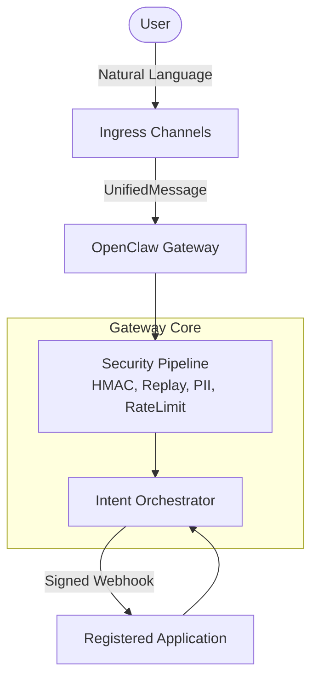

# OpenClaw App Orchestration Layer

OpenClaw becomes the AI control plane for any application — any app that exposes an API can be queried, modified, and monitored through natural language, across any channel, with full audit trail and HMAC-secured intent dispatch. The security model makes it impossible for an attacker to forge, replay, escalate, or exfiltrate through any channel.

## Overview & Architecture

OpenClaw acts as an intent gateway. It receives messages from various channels (Slack, WhatsApp, etc.), translates them into intents, validates permissions and security rules, and securely dispatches them to registered applications.



## Projects

This repository contains two completely isolated projects:
- `com.niyogen.mapping`: The core orchestration implementation.
- `com.niyogen.test`: The test suite (unit, integration, e2e, and contract tests).

## Quickstart

### 1. Register an Application
Register an application using the Admin API:
```bash
curl -X POST http://localhost:8080/v1/apps \
  -H "Content-Type: application/json" \
  -H "X-Niyogen-Tenant: your-tenant-id" \
  -d '{
    "app_id": "demo-app",
    "name": "Demo Application",
    "description": "My first OpenClaw app",
    "base_url": "https://api.demo-app.com",
    "auth_type": "hmac"
  }'
```

### 2. Generate a Trigger Key
Generate a trigger key to allow the app to initiate flows:
```bash
curl -X POST http://localhost:8080/v1/apps/demo-app/trigger-keys \
  -H "Content-Type: application/json" \
  -H "X-Niyogen-Tenant: your-tenant-id" \
  -d '{
    "intent_name": "create_ticket",
    "user_id": "user123",
    "scope": "read_write",
    "callback_url": "https://callback.demo-app.com"
  }'
```

## Channel Integration Setup

1. **Slack**: Configure the Slack Events API webhook to point to `/slack/events`. Enable necessary scopes for reading messages.
2. **WhatsApp**: Configure the webhook URL for incoming messages to point to `/whatsapp/webhook`.
3. **REST**: Send standard HTTP POST requests to the `/api/message` endpoint with a Bearer token.

## API Endpoint Reference

### Admin API

| Method | Endpoint | Description |
|--------|----------|-------------|
| `POST` | `/v1/apps` | Register a new application |
| `POST` | `/v1/apps/{id}/trigger-keys` | Generate a new trigger key for an application |
| `DELETE`| `/v1/apps/{id}/enable` | Disable an application (Kill switch) |

For detailed schemas and parameters, refer to the generated Swagger UI or the `admin.Handler` source code.

## Documentation
Please refer to the `implementation_plan.md` for architecture details, including capability descriptions, threat models, and phased implementation progress.
